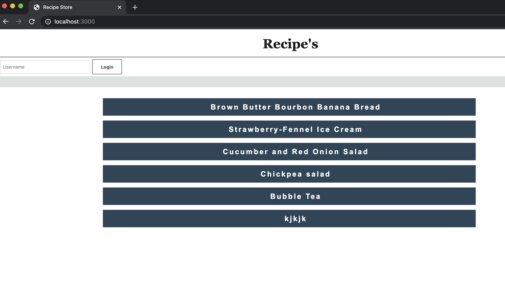
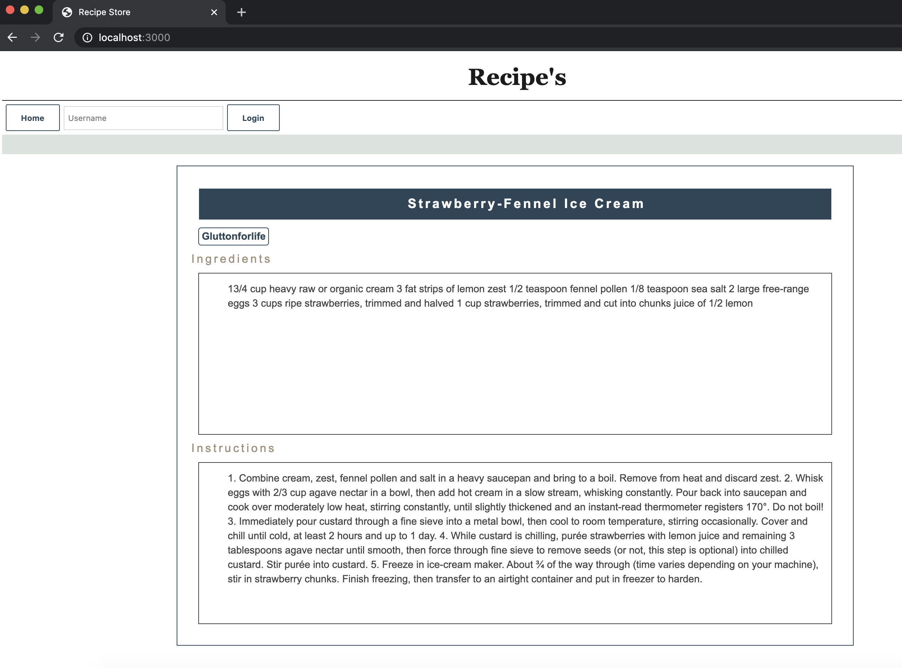
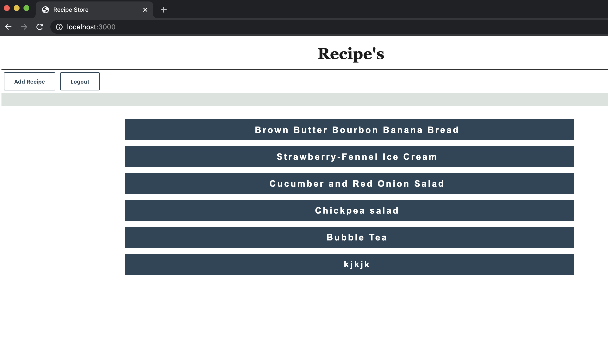
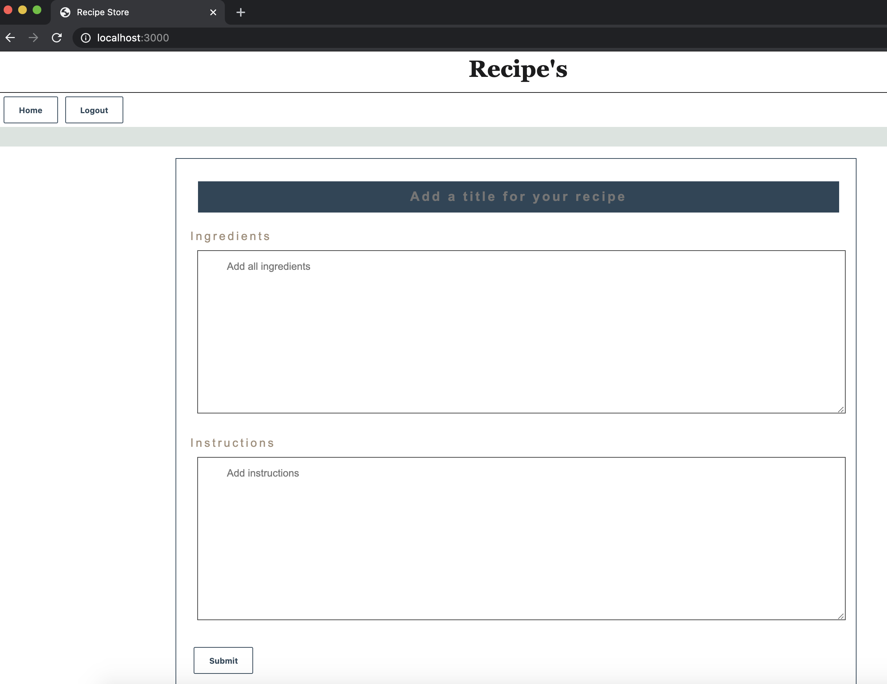

# Recipe Book

Web application to share Recipes. It allows users to add new Recipes to share it with other users.

## How it works?

* Users can view all Recipes on home page.
* On clicking a Recipe, the details including author, Ingredients and Instructions of the recipe are shown.
* When logged-in, users can click on `Add Recipe` button to add a new recipe. 
* On clicking the `Add Recipe` button the user will be directed to the page where Title, Ingredients, and Instructions of the recipe can be added. 
* The user can save the recipe upon entering all the fields and clicking the `Submit` button.

## Technical details

* The application uses html and CSS.
* The server implement RESTful API's and is built in JaveScript and runs on NodeJS.

## External libraries

* express.js
* cookie-parser
* webpack
* babel-loader

## Run Recipe Server

* Download this repository.
* Open folder word-guessing-game/ from the repository on terminal.
* Run `npm install` and then `npm start`.

## Game screen caps

__Home Page__

__Recipe Details__

__User Logs-In__

__Add Recipe__

